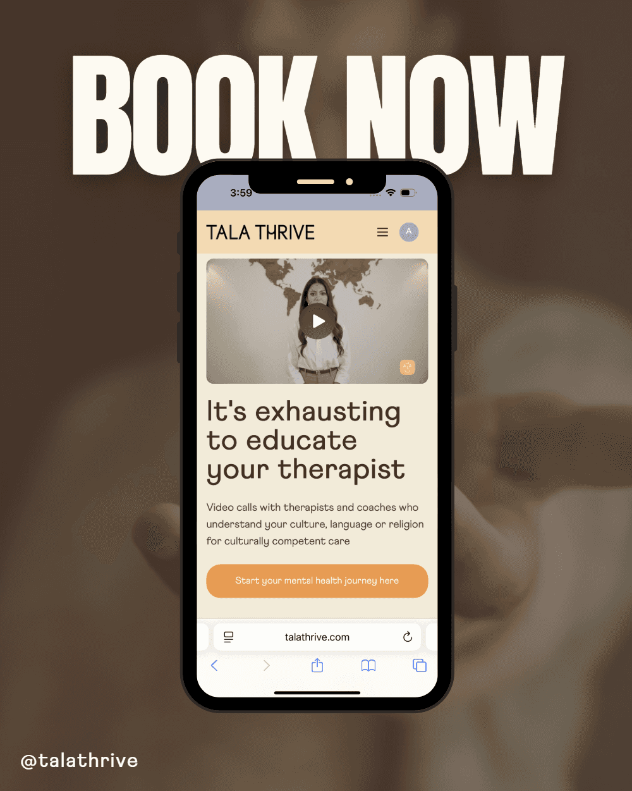

# How to Begin Healing from Generational Trauma

Sometimes, we carry emotional wounds that didn’t start with us. Invisible threads tie us to the pain, resilience, and experiences of our ancestors. They may have started decades,even centuries, ago, and yet they still show up in our bodies, relationships, and mental health today as generational trauma.

In the UK, these stories of generational trauma are woven into our shared history. From the Windrush Generation who faced discrimination after being invited to rebuild post-war Britain, refugees who fled violence only to find new struggles here, and families still processing the intergenerational impact of colonialism. Our collective history is complex and these experiences didn’t just shape social systems; they shaped how many of us move through the world.

You might notice this in subtle ways. It could manifest as the pressure to always be strong, to never show weakness, or to prove your worth over and over again. It might show up as anxiety, emotional numbness, or a fear of instability, even when things are “fine.” Generational trauma can live quietly inside us, guiding our reactions long before we even realise where they came from.

#### **Understanding the Weight We Carry**

Generational trauma affects mental health in countless ways. For some, it shows up as chronic stress, depression, or a deep sense of disconnection. For others, it’s the inherited silence of “*we don’t talk about that*” mindset that leaves emotions bottled up for years.

For many communities in the UK, especially those shaped by migration, racism, and displacement, there’s also a unique cultural layer. The Windrush Generation, for instance, faced not only systemic injustice but also the heartbreak of feeling unwelcome in a country they helped rebuild. That pain of exclusion, loss, and having to be endlessly resilient often trickles down through generations.

It’s important to acknowledge that healing doesn’t mean forgetting. It means understanding where the pain comes from and learning new ways to carry it.

#### **How Online Therapy Can Help**

One of the most powerful tools in healing generational trauma is culturally competent therapy but for many, traditional therapy remains a stigma and hasn’t always felt accessible or culturally safe. This is where online therapy can make such a difference.

Online therapy allows people to connect with therapists who understand their background and identity. It opens doors to culturally competent care, where you don’t have to explain the cultural nuances of your experience because your therapist gets you from day one. They understand how racism, migration, and intergenerational expectations shape your mental health.

This kind of culturally competent care helps you unpack not just personal pain, but historical and cultural wounds caused by generational trauma too. It’s therapy that recognises context and that’s where true healing begins.

#### **Simple Steps Toward Healing Generational Trauma**

Healing generational trauma isn’t a quick fix. It’s a process that starts with awareness and compassion. Here are a few gentle steps:

1. **Acknowledge the past -** Learn your family’s story. Ask questions. Even painful truths can bring understanding.
2. **Name what you’re feeling** - Giving your emotions language helps release them from silence.
3. **Seek culturally competent support -** Whether through online therapy or community spaces, find support that honours your identity.
4. **Practice grounding -** Mindfulness, journaling, and connecting to cultural practices can help you stay present.
5. **Break the cycle with compassion** - Every act of self-care is a step toward healing for the generations that come after you.

#### **Our Self-Guided Healing Program**

We’re building a self-guided program designed to help people explore generational trauma and begin their healing journey in their own time and space. The program blends insights from mental health professionals, reflective journaling, mindfulness tools, and lessons on intergenerational resilience. It’s a gentle, step-by-step space where you can learn, reflect, and grow whether you’re in therapy or just beginning to explore your emotional roots.

Our goal is to make culturally competent care and healing resources more accessible for everyone, wherever they are. Because your story deserves to be held with understanding, and your healing matters not just for you, but for generations to come.

### **Book your first session today**

At Tala Thrive, we connect you with culturally competent therapists, counsellors, and coaches who understand your culture, language and/or religion, and can help you unpack why you may not be feeling ok.

Download our app and book your first session today at Talathrive.com and join our community to get the support you need.

If you sign up today, you get 10% OFF your first session with code: **NEWYEAR10**

**Remember, we want you to thrive - mentally, physically, and emotionally - so you can start living the life you truly deserve.**
