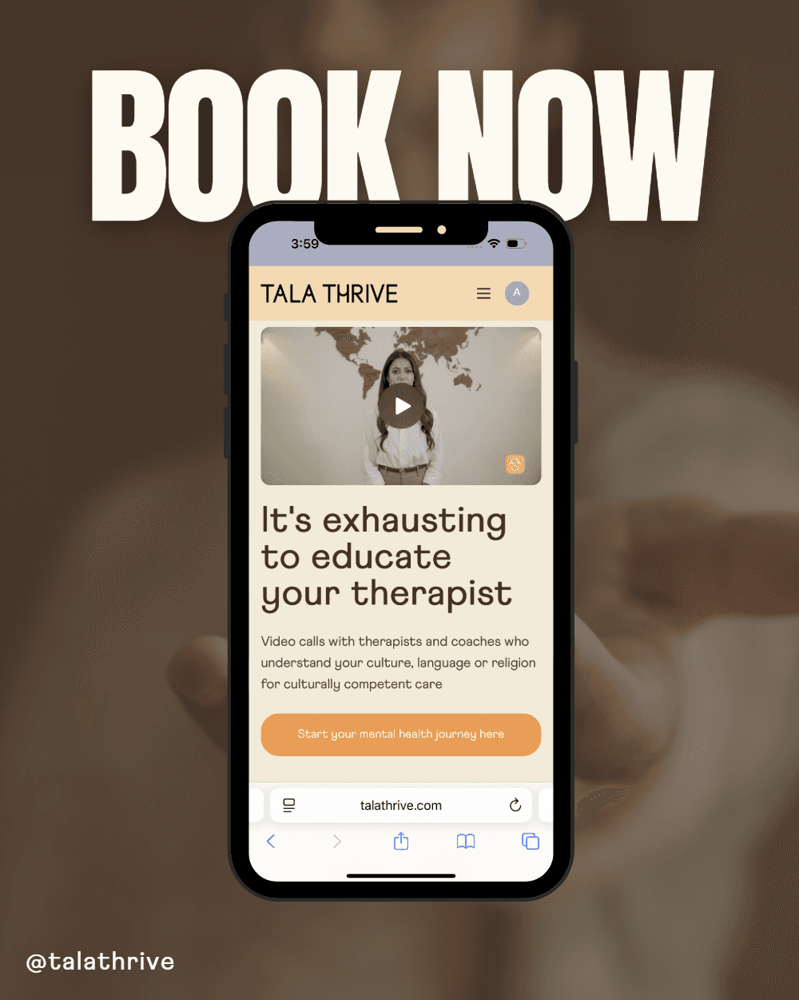

# Racism and Mental Health: How Online Therapy Can Help

October is Mental Health Month in Australia, and the intersection between racism and mental health is something many of us feel deeply, yet often struggle to put into words.

These days, we talk more openly about anxiety, depression, and self-care (thankfully!), but conversations about racism’s emotional toll are often still whispered in private. For migrants, refugees, First Nations people, Indigenous Australians, as well as several communities of colour, the truth is simple but painful: racism hurts. It doesn’t just hurt feelings, it hurts mental health.

And it’s not only in Australia. Around the world, we’re seeing an increase in racism and xenophobia. From online hate and political polarisation to discrimination in workplaces and schools, racism is becoming louder, more visible, and more normalised in some spaces. The rise of social media has made it easier for hateful messages to spread, often targeting people simply for who they are, their skin colour, accent, religion, culture, or heritage.

This global wave of racism affects our collective mental health in ways we’re only beginning to understand. Every racist comment, exclusion, and microaggression adds up. It creates a kind of background minority stress that never fully goes away. For many people, this constant exposure leads to anxiety, hypervigilance, depression, and trauma. It erodes self-esteem and belonging, and replaces psychological safety with fear.

Many marginalised people are tired of explaining their life experiences. Self-doubt is one of racism’s cruelest effects on mental health because It convinces people to silence themselves.

In the past, finding a culturally competent therapist who understood the complexities of race, culture, and identity could feel impossible. Gratefully things are changing and this is why Tala Thrive has brought one of the biggest shifts in online therapy and mental health care

Culturally competent care means working with professionals who don’t just recognise cultural differences, but who actively respect and integrate them into therapy. They understand how systemic racism, colonial histories, and cultural identity intersect with mental health. For Indigenous and multicultural clients, that understanding can be the difference between feeling dismissed, and feeling truly seen and heard.

And for many, the online space feels safer. Talking about racism and mental health can be painful especially when those experiences are minimised by others. Online therapy offers a level of comfort that allows people to open up from their own homes without the fear of judgment. It’s therapy on your terms whether that’s through video calls, phone sessions, or even chat-based therapy.

What’s also amazing is how online therapy is helping bridge the gap for people living in rural or remote areas of Australia where access to mental health services is limited. You don’t have to live in a major city to get the support you deserve. You just need an internet connection and the courage to reach out.

This Mental Health Month, let us take a moment to reflect on what healing looks like, not just individually, but collectively. Racism chips away at mental health, but community, compassion, and access to culturally competent care through online therapy can help us rebuild.

If you’ve ever felt unseen or unheard because of your race or background, please know you’re not alone. Your story matters. Your feelings are valid. And help is out there from people who understand what you’re going through from day one.

So maybe this October, part of taking care of your mental health is finding a therapist who gets it. Someone who can help you unpack not just your stress, but the systems that create it. Someone who can help you heal from the subtle and not-so-subtle harms of racism, in a space that feels safe.

Because mental health care should never be one-size-fits-all. It should be shaped by empathy, understanding, and culture. And that’s exactly the kind of online therapy and culturally competent mental health care Tala Thrive offers.

Let’s make space for these conversations, not just this month, but every month. Healing from racism and mental health struggles takes time, but with the right support, you’ll start thriving instead of simply surviving.

### **Book your first session today**

At Tala Thrive, we connect you with culturally competent therapists, counsellors, and coaches who understand your culture, language and/or religion, and can help you unpack why you may not be feeling ok.

Download our app and [**book your first session today at Tala Thrive**](https://www.talathrive.com/#join) and join our community to get the support you need.

If you sign up today, you get 10% OFF your first session with code: **LAUNCH10**

**Remember, we want you to thrive - mentally, physically, and emotionally - so you can start living the life you truly deserve.**
